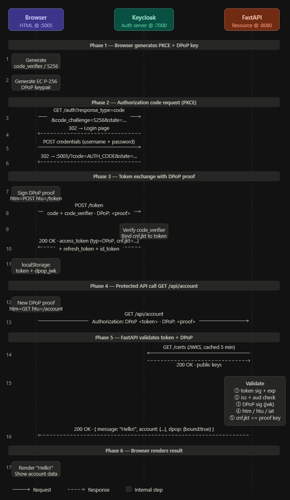
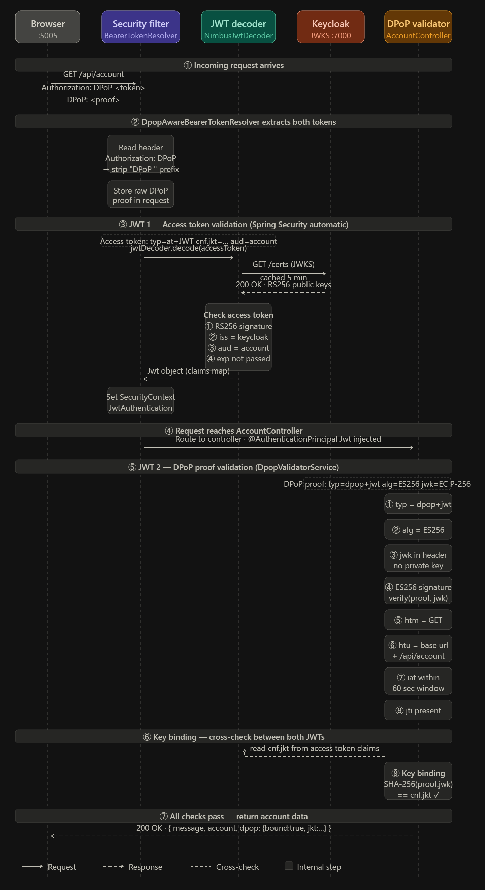
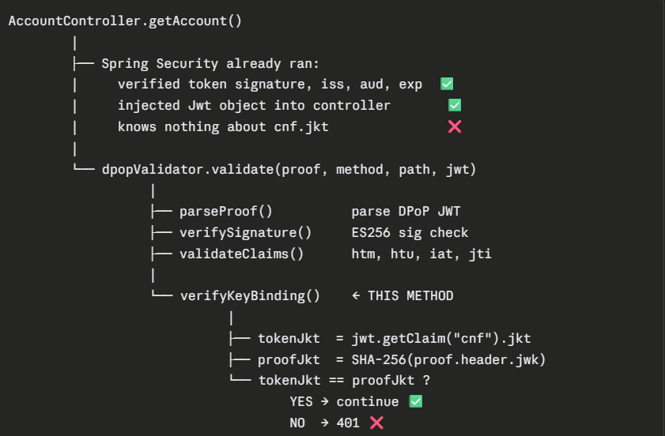

# DPOP validation by fastapi as resource server



# DPOP validation by Spring boot as resource server



```
Here's the key insight the diagram shows — two completely separate JWTs are validated independently, then cross-checked against each other:

JWT 1 — Access token (validated by Spring Security automatically, before your code runs)

Spring's BearerTokenResolver strips the DPoP  prefix and extracts the raw token
NimbusJwtDecoder fetches Keycloak's JWKS (cached 5 min), verifies the RS256 signature, checks iss, aud, and exp
On success, a Jwt object is placed in SecurityContext and injected into your controller via @AuthenticationPrincipal

JWT 2 — DPoP proof (validated manually in DpopValidatorService, inside your controller)

typ = dpop+jwt — identifies it as a DPoP proof, not a regular JWT
alg = ES256 — must be the EC algorithm
Embedded jwk in the header — the browser's public key, no private material allowed
Signature verified using that embedded JWK — proves the caller holds the private key
htm / htu / iat / jti — locks the proof to this exact request, URL, and moment in time

Step ⑨ — The cross-check (the critical link between the two)

From JWT 1: extract cnf.jkt (the thumbprint Keycloak embedded at login time)
From JWT 2: compute SHA-256(proof.jwk) — the thumbprint of the key that just signed the proof
They must match exactly — this proves the same browser that obtained the token is making this request
```

